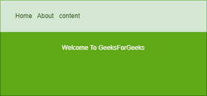

    Create a simple website using all types of three css in one website.
    Create a css class one and verify that it works on multiple elements.
    Change the color of main container on your page to green.
    create a colourful table and add a designed submit button to it.
    create a following navigation bar :
    
    Create a rotating image animation using Css.
